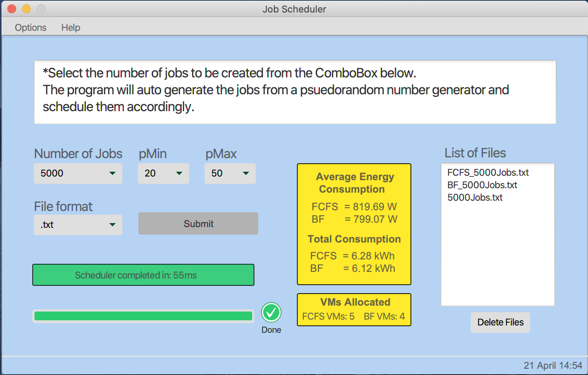

# JobScheduler

This JavaFX program generates a set of jobs from a psuedorandom number generator (PRNG), and shows the schedule of
each job to a resource at every given stage. The output is the energy consumption of the given schedule influenced via a given pMin and pMax value.

The pMin, pMax values are the minimum and maximum power constraint given to a resource. For example, a pMin value of 20 and a pMax value of 50 corresponds to a power constraint of 200 Watts and 500 Watts respectively.

The calculation also creates an idle mode, or 'power saving mode' when the utilisation of a resource goes down to 0%. At this level of utilisation the resource uses 10% of the pMin value. So if the pMin value is 200 Watts the idle mode will consume 20 Watts of power.

The output can be selected as either a __.txt__ file or a __.csv__ file. With the files being saved in the directory of the program under:
```
src/sample/Output/
```

## Energy Calculation
There is a known bug in the calculation of the overall energy consumption not producing the exact value. This is because the calculation is being drawn from the state of resources at each given arrival time. Subsequently, a job may be released in the window between the arrival times of different tasks.

### Total Energy
The total energy consumption is calculated as a summnation of each figure of Wattage at each resource state. This is then multiplied by the time at which the resource sits at that utilisation. The resulting value is a large number that is the amount of Watt seconds / Joules the schedule outputs. To get the output in kWh the value is divided by 3,600,000, where it is calculated from 3,600 seconds in a given hour and 1,000 Watts in a Killowatt. Thus 3,600 * 1,000 = 3,600,000. This follows the guidelines from the [National System of Units](https://www.bipm.org/utils/common/pdf/si-brochure/SI-Brochure-9-EN.pdf).


### Average Energy
The average energy value you see is the average power consumption across all active resources for the duration of the schedule, in correlation to the pMin and pMax value selected.

# Build

There is currently an issue with IntelliJ (the IDE this was created on) and bundling JavaFX programs with Ant in any Java
version that isn't Java 8. This was created in Java 11.

Issue Details:
[[JetBrains Ticket 200721]](https://youtrack.jetbrains.com/issue/IDEA-200721?_ga=2.224905754.1868922875.1585741664-751629145.1585393092)

Therefore, to build this program either clone or download this repository and set the Main class as:
```
src/sample/Main.java
```
A virtual environment may need to be created for all of the libraries and imports that are required.


## View

Below is a screenshot of the running program, along with the output of the schedule saved as a __.txt__ output.

It is worth noting that some of the files that are generated can be in excess of > 25MB each. In which case the delete
button was implemented so that the files can be removed once you're finished creating the schedule.


### Program Image

</a> 


 <br />
 <br />
 <br />
 <br />
 <br />
 <br />
 <br />
 <br />
 <br />
 <br />
 <br />
 <br />
 <br />
 <br />
 <br />
 <br />
 <br />
 <br />
 <br />
 <br />

### Scheduled Output in .txt Format

</a> 


